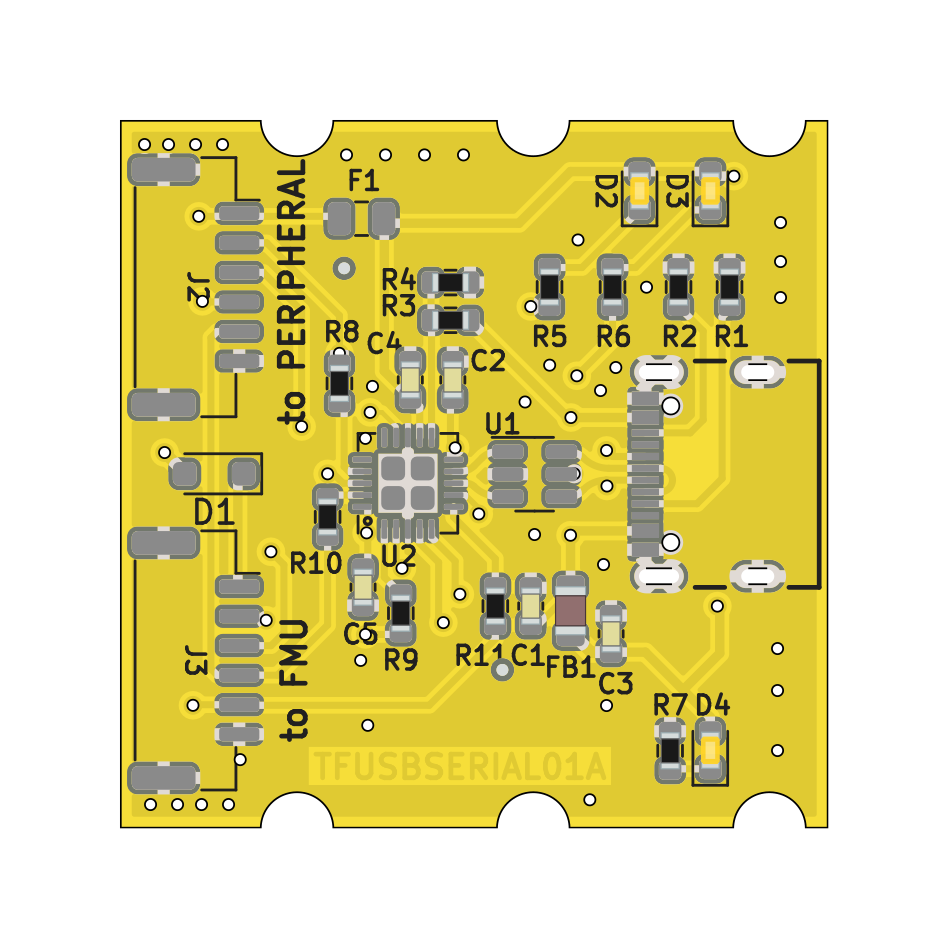
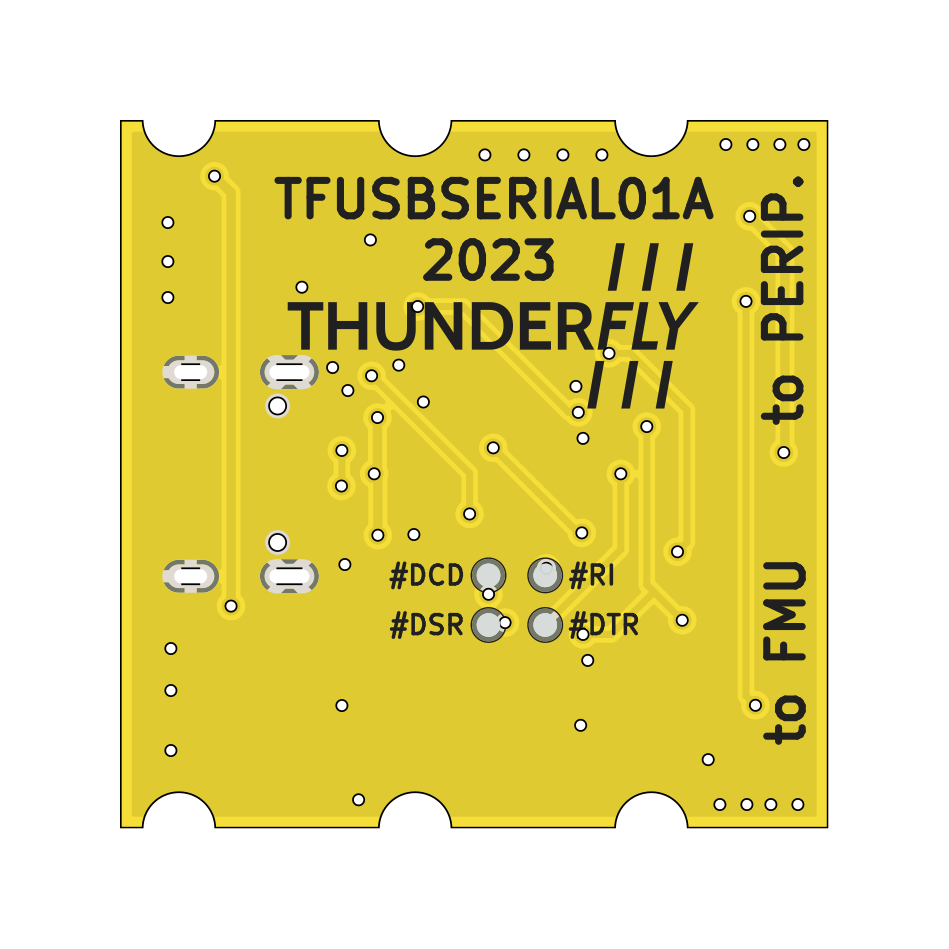

# TFUSBSERIAL01 - USB-C to serial converter with Pixhawk telemetry JST-GH connector

The converter is designed to service operations on UAVs. It respects the [Pixhawk DS-009](https://github.com/pixhawk/Pixhawk-Standards/blob/master/DS-009%20Pixhawk%20Connector%20Standard.pdf) connector standard.

## Key features
 
  * Could be connected to both peripheral or FMUs
  * The FMU and peripheral connectors are separated, therefore there is no need for a special RX/TX cross cable
  * Could be used for sniffing serial communication on telemetry links between autopilot and its peripheral (Both connectors could be used at once)
  * Supports hardware flow control
  * The power delivered from USB is protected from excess current possibly drawn by peripheral or FMU
  * The accidental power from FMU to USB is protected by reverse diode
  
  
### Self-test 

The proper function and cable could be easily tested by connecting the cable between "to FMU" and "to Peripheral" connectors. 

All communication send by UART is in that case forwarded in loop. Therefore the cable behave the same as "local-echo".
